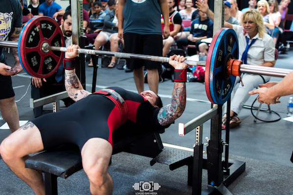

# tensorflow-docker-retrain

`tensorflow-docker-retrain` uses the [TensorFlow](https://www.tensorflow.org/) framework to retrain an existing [MobileNet](https://github.com/tensorflow/models/blob/master/research/slim/nets/mobilenet_v1.md) (or [InceptionV3](https://github.com/tensorflow/models/tree/master/research/inception)) classifier via [Docker](https://www.docker.com/) without ever having to install TensorFlow.

You can provide your own training images from any source by creating the appropriate directory structure. This repository optionally provides the ability to split a video into individual frames that can be used to quickly gather a significant number of training images.

**For a full tutorial on how this works and how to use it, [click here](https://kylewbanks.com/blog/tutorial-transfer-learning-retraining-inception-mobilenet-with-tensorflow-and-docker).**

## Preparing Training Data from Videos

1. Place your **.mp4** video files in [frame-extraction/videos/](./frame-extraction/videos/)
2. `docker build -t frame-extraction frame-extraction/`
3. `docker run -it -v $(pwd)/frame-extraction:/data frame-extraction`
4. Retrieve the split video frames from [frame-extraction/frames/](./frame-extraction/frames), and place in the appropriate directory structure.

## Training the Classifier

Before training you must build the generic `train-classifier` Docker image:

```sh
$ docker build -t train-classifier train-classifier/ 
```

Next invoke the **train-classifier** image by mounting the directory containing your training images as **/input** and an output directory as **/output** which will contain the trained model and labels text file after successful training.

```sh
$ docker run -it \
    -v $(pwd)/path/to/training-images:/input \
    -v $(pwd)/output:/output \
    train-classifier
```

## Performing Predictions

Once you have a trained model, you can use it to perform predictions like so:

```sh
$ docker build -t predictor predictor/
$ docker run -it \
    -v $(pwd)/path/to/model/dir/:/model \
    -v $(pwd)/path/to/image:/input \
    predictor \
    image_name.jpg
```

**Note:** You need to mount two volumes here:

1. `/model` is the path to your trained model and labels, the equivalent of **/output/tf_files** from the training step above. 
2. `/input` is the folder that contains your image to predict. 

Finally, `image_name.jpg` can be substituted for the image you want to predict.

## Examples 

Using a model trained on approximately 750 images of the three powerlifts (Squat, Bench Press, and Deadlift), the output for two images that were not part of the training set (in fact none from this date or location were) looks like:


```
squat 0.999975
bench press 2.05499e-05
deadlift 4.10849e-06
```



```
bench press 0.930678
squat 0.0616271
deadlift 0.00769532
```


```
deadlift 0.928004
squat 0.0719689
bench press 2.72259e-05
```

## Authors

- [Kyle Banks](https://kylewbanks.com/blog)

## License

```
MIT License

Copyright (c) 2017 Kyle Banks

Permission is hereby granted, free of charge, to any person obtaining a copy
of this software and associated documentation files (the "Software"), to deal
in the Software without restriction, including without limitation the rights
to use, copy, modify, merge, publish, distribute, sublicense, and/or sell
copies of the Software, and to permit persons to whom the Software is
furnished to do so, subject to the following conditions:

The above copyright notice and this permission notice shall be included in all
copies or substantial portions of the Software.

THE SOFTWARE IS PROVIDED "AS IS", WITHOUT WARRANTY OF ANY KIND, EXPRESS OR
IMPLIED, INCLUDING BUT NOT LIMITED TO THE WARRANTIES OF MERCHANTABILITY,
FITNESS FOR A PARTICULAR PURPOSE AND NONINFRINGEMENT. IN NO EVENT SHALL THE
AUTHORS OR COPYRIGHT HOLDERS BE LIABLE FOR ANY CLAIM, DAMAGES OR OTHER
LIABILITY, WHETHER IN AN ACTION OF CONTRACT, TORT OR OTHERWISE, ARISING FROM,
OUT OF OR IN CONNECTION WITH THE SOFTWARE OR THE USE OR OTHER DEALINGS IN THE
SOFTWARE.
```
